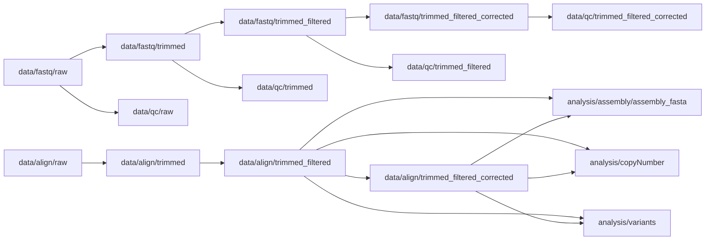

# Directory Standard

Standard directory structure for ONT sequencing analysis of a single cell line or entity. Contains raw and processed data, analysis outputs, and final results.

## Processing flow

## Stages
- **analysis** — Active analysis outputs (genome assembly, CNV, variant calling, etc.)
- **data** — All data files used in the analysis (raw → processed)
- **results** — FINAL output files — static figures and tables for publication or reporting

